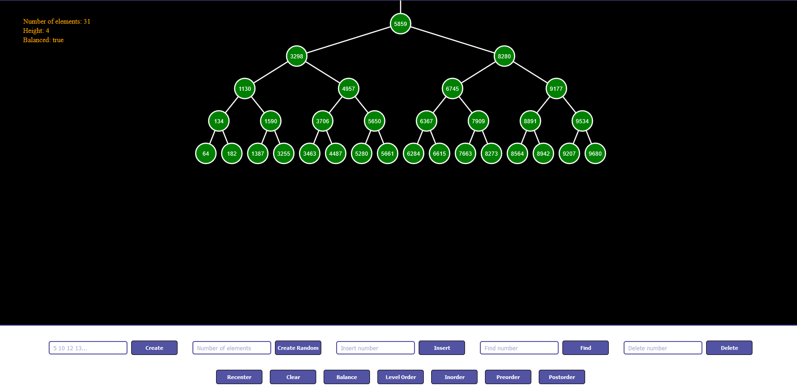

 

<h3 align="center">
  <a href="https://imaginepog.github.io/bst-simulation/">BST Sim</a>
</h3>
  

    A binary search tree implementation and simulation in JS
  

## Table of Contents

- [About The Project](#about-the-project)
  - [Tools Used](#tools-used)
  - [Features](#features)
- [What I Learned](#what-i-learned)
- [Future updates](#future-updates)
- [Live Github page](#live-github-page)

## About The Project

A simple implementation of a **binary search tree (BST)** data structure and basic visualization of its behaviors. This project was started to learn more about how a binary search tree works and then visualized to make the process easier. Although the project is not perfect it shows the basic behavior of a simple binary search tree. This project was a "rollercoaster" of sorts, implementing the binary search tree was relatively effortless compared to visualizing it. For the visualization I came across many methods but they were a bit too complex so I only used small parts of it.

### Tools Used

- HTML5 Canvas
- Javascript
- CSS
- NPM
- Webpack

### Features

- Displays a binary tree capable of storing 2000 nodes.
- Animates insertion and deletion of nodes in a binary search tree.
- Shows traversal of the tree in different orders: **level-order, in-order, pre-order, post-order**.
- Allows user to move around the tree using arrow keys.
- Trees that are created randomly or by data are **balanced** and can also be **balanced** when desired.
- Displays the details of the tree: Height, Number of nodes, Balanced status etc.
- Allows user to find a node and view its height and depth

(<a href="#top">back to top</a>)

## What I Learned

- **Binary Search Trees:** Obviously, I had to work A LOT with the tree's behaviors and nodes. I implemented finding nodes, inserting nodes, deleting nodes, creating trees with nodes, getting height and depth of nodes etc.. which really improved my understanding of this data structure.

- **Data Structures:** As I learned how a _binary search tree_ works I got more familiar with data structures like _Linked List_, _Queues_ (for level order traversal) and _Stacks_ (for recording traversals and behaviors)

- **Using recursion:** Recursive functions were the go-to for most features of the _binary search tree_

- **Visualising a tree:** What seemed simple at first turned out to be the biggest obstacle for this project. I had to go through articles and found that there were some methods developed for visualising a tree properly. These articles were too complex and had a lot of "aesthetics" so I only used a small version of them. I finally got the overlaps that were troubling me to stop but the spacing leaves more to desired.

- **Animating:** I climbed up the mountain of visualising only to realise there was yet another peak that I had to conquer: Animating. I learned a lot about the HTML5 canvas and the BST itself for making animation of the behaviors work.

- **Timeouts and intervals:** Javascripts' intervals and timeouts were handy for implementing the animations.

(<a href="#top">back to top</a>)

## Future updates

- **Implement Reingold-Tilford Algorithm:** Although I haven't yet understood the Reingold-Tilford algorithm I plan to implement it in the future to make the trees more space efficient and tidier.

- **Improve animation:** Right now the animations are very simple and the way it was implemented is not expandable.

- **Refactoring:** The project's maintenance fell apart as I encountered harder problems and my focus was more in solving them instead of maintaing the code. The code should be refactored for the future.

- **Optimize:** The app lags when large number of nodes are created and this should be optimized in the future.

- **Better design:** The design right now is really crappy and its hard to see the details of the tree sometimes. This should be fixed in the future.

(<a href="#top">back to top</a>)

## Live GitHub page

[Hosted live on github pages][gh-page]

(<a href="#top">back to top</a>)

<!-- LINKS -->

[gh-page]: https://imaginepog.github.io/bst-simulation/
